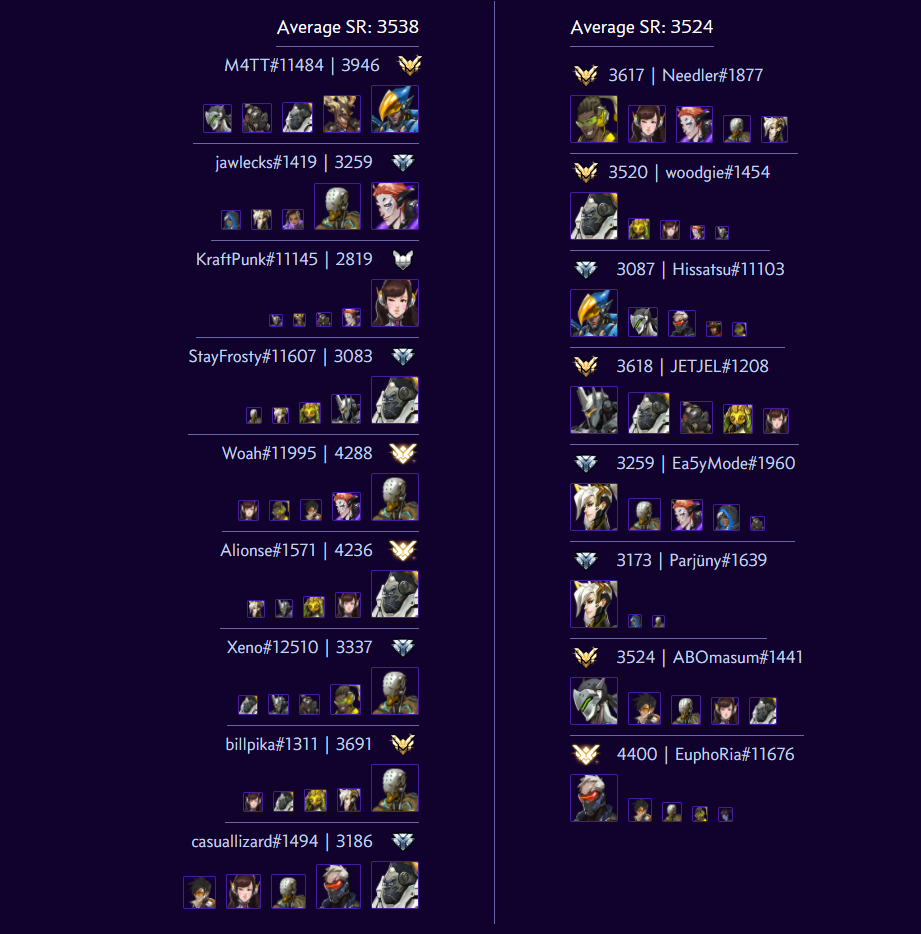
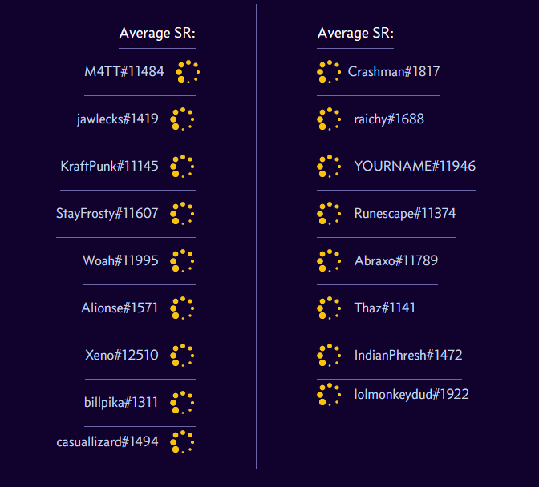
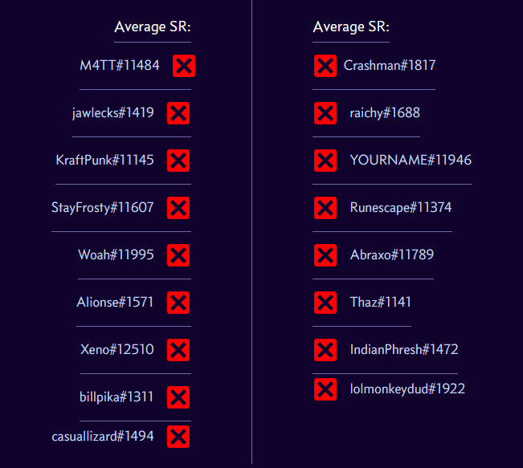

## Tespa Stats
This is a simple chrome extension that adds Overwatch statistics to Tespa match pages. When you go to a Tespa match page it will load each player's rank and top 5 played heroes and add them to the page.

### How to Use
1. Download this repository.
2. Go to Extensions in Chrome and turn on developer mode.
3. Select 'Load Unpacked' and choose the Tespa Stats folder.
4. Navigate to any Tespa match page (e.g. `https://compete.tespa.org/tournament/*/match/*`).

The statistics may take some time to load in. While they load, you will see a loading icon:

Sometimes the API we use will return an error because of too many requests. If that happens, you will see an error icon:

### Sources
Overwatch statistics are retrieved from [owapi.net](https://owapi.net/).